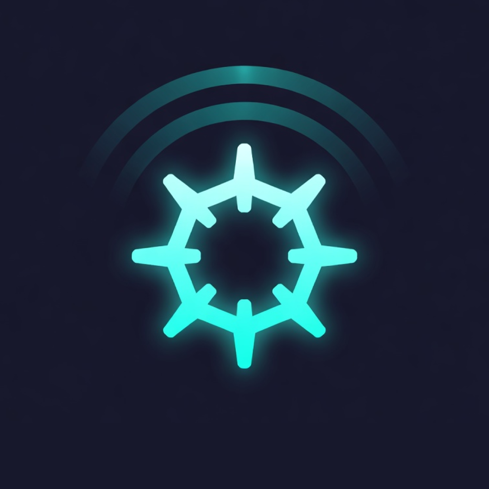

<p align="center">
  
</p>

<h1 align="center">ISAC-k8s</h1>
<p align="center">Distributed 6G ISAC sensing fleet on KubeEdge</p>

<p align="center">
  <a href="https://gambhirsharma.github.io/ISAC-k8s/"></a>
  <a href="LICENSE"></a>
  <a href="CONTRIBUTING.md"></a>
</p>

---

A distributed **6G ISAC** (Integrated Sensing And Communication) system: a 5-stage gRPC detection
pipeline (`simulator → ingestion → preprocessing → inference → output`) running across a fleet of
edge nodes on **KubeEdge**, with per-node latency observability in Prometheus/Grafana.

Each edge node runs the whole detection hot-path **locally**; only the resulting `DetectionResult`
fans in over the network to one central `output` collector, which tracks connected edge nodes,
records their latency, and serves a searchable dashboard. Add an edge node → join with `keadm` →
label it → its pipeline auto-schedules and starts reporting.

The `simulator` generates synthetic CSI as a stand-in for a future **6G ISAC sensor** — the only
component swapped for real hardware later; everything downstream is source-agnostic.


## Quickstart

```bash
# 1. Cloud control plane (once) — needs only Docker
make cloud-init CLOUDCORE_IP=<ip edges will dial, e.g. your Tailscale IP>

# 2. Build images + deploy the pipeline (edge DaemonSets stay 0 pods until a node is labeled)
make build-images REGISTRY=gambhir
make namespace CONTEXT=kind-isac
make deploy    CONTEXT=kind-isac REGISTRY=gambhir

# 3. Add an edge node — a real device...
make keadm-token                                              # on the cloud host
sudo ./scripts/join-edge.sh <CLOUDCORE_IP> <node> <token>    # on the edge device
make onboard-edge CONTEXT=kind-isac EDGE_NODE_NAME=<node>

# ...or a co-located test edge on this host (no extra device)
make edge-container CONTEXT=kind-isac CLOUDCORE_IP=<ip> EDGE_NODE_NAME=edge-test

# 4. View the fleet
make port-forward-dashboard CONTEXT=kind-isac   # -> http://localhost:8080/
make port-forward-grafana   CONTEXT=kind-isac   # -> http://localhost:3000/  (admin/admin)
```

## 📖 Documentation

Everything else — architecture, per-topic deep-dives, full deployment guide, Makefile reference,
verification checklist — lives at **<https://gambhirsharma.github.io/ISAC-k8s/>**:

- [Architecture overview](https://gambhirsharma.github.io/ISAC-k8s/architecture) — cluster shape,
  the three load-bearing design decisions, and per-topic drill-downs (pipeline, gRPC, edge node,
  networking, observability, latency & clock sync).
- [Deployment & operations](https://gambhirsharma.github.io/ISAC-k8s/deployment) — full setup,
  options, Makefile reference, and the verification checklist.

## Contributing

Issues and PRs welcome — see [CONTRIBUTING.md](CONTRIBUTING.md) for the dev loop and design docs
worth reading first.

## License

[MIT](LICENSE)
