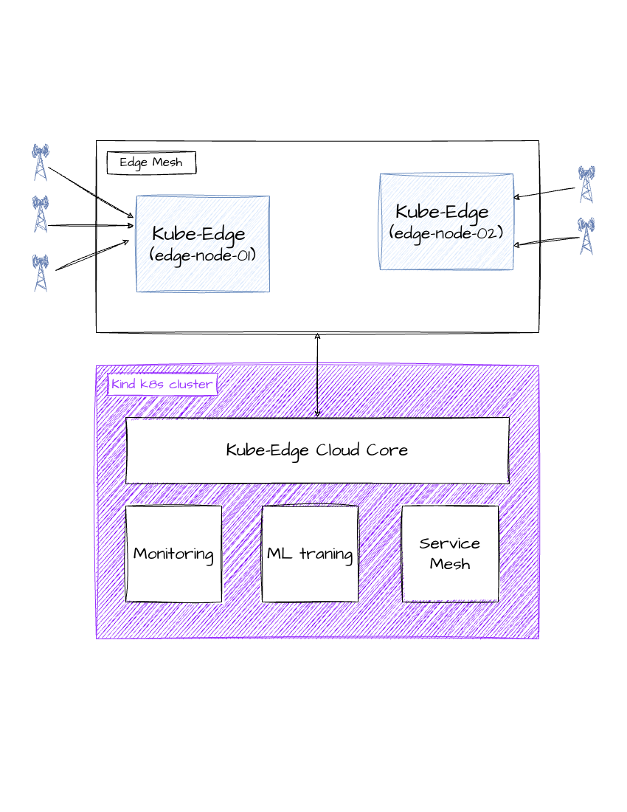

# ISAC-k8s — multi-edge sensing fleet on KubeEdge

A distributed **6G ISAC** (Integrated Sensing And Communication) system: a 5-stage gRPC detection
pipeline (`simulator → ingestion → preprocessing → inference → output`) running across a fleet of
edge nodes on **KubeEdge**, with per-node latency observability in Prometheus/Grafana.

Each edge node runs the whole detection hot-path (`simulator → ingestion → preprocessing →
inference`) **locally**; only the resulting `DetectionResult` fans in over the network to one central
`output` collector, which tracks connected edge nodes, records their latency, and serves a searchable
dashboard. Add an edge node → join with `keadm` → label it → its pipeline auto-schedules and starts
reporting.

The `simulator` generates synthetic CSI as a stand-in for a future **6G ISAC sensor** — the only
component swapped for real hardware later; everything downstream is source-agnostic.


The KubeEdge topology — edge nodes in the Edge Mesh running the hot-path, fanning in to the CloudCore
on the kind cluster:



## 📖 Documentation

Full docs (architecture, per-topic deep-dives, deployment): **<https://gambhirsharma.github.io/ISAC-k8s/>**

- [Architecture overview](https://gambhirsharma.github.io/ISAC-k8s/architecture)
  · [Pipeline & services](https://gambhirsharma.github.io/ISAC-k8s/architecture/pipeline)
  · [gRPC & proto](https://gambhirsharma.github.io/ISAC-k8s/architecture/grpc-proto)
  · [Edge node](https://gambhirsharma.github.io/ISAC-k8s/architecture/edge-node)
- [Networking](https://gambhirsharma.github.io/ISAC-k8s/architecture/networking)
  · [Observability](https://gambhirsharma.github.io/ISAC-k8s/architecture/observability)
  · [Latency & clock sync](https://gambhirsharma.github.io/ISAC-k8s/architecture/latency)
- [Deployment & operations](https://gambhirsharma.github.io/ISAC-k8s/deployment)

## Cluster shape

| Node | KubeEdge role | Runs |
|---|---|---|
| cloud (**kind** cluster, single untainted node) | `cloudcore` (CloudHub + CloudStream + dynamicController) | `output` (collector + dashboard), `prometheus`, `grafana` |
| edge node ×N (`edgecore`, label `isac-edge=true`) | `edged` + `edgehub` + `metamanager` + `edgeStream` | `simulator`, `ingestion`, `preprocessing`, `inference` (DaemonSets) |

Edge hot-path hops run over `localhost` (hostNetwork, no kube-proxy). The one cross-node hop
(`inference → output`) resolves via EdgeMesh, with a NodePort `:30054` fallback.

## Quickstart

```bash
# 1. Cloud control plane (once) — needs only Docker
make cloud-init CLOUDCORE_IP=<ip edges will dial, e.g. your Tailscale IP>

# 2. Build images + deploy the pipeline (edge DaemonSets stay 0 pods until a node is labeled)
make build-images REGISTRY=gambhir
make namespace CONTEXT=kind-isac
make deploy    CONTEXT=kind-isac REGISTRY=gambhir

# 3a. Add a real edge device
make keadm-token                                              # on the cloud host
sudo ./scripts/join-edge.sh <CLOUDCORE_IP> <node> <token>    # on the edge device
make onboard-edge CONTEXT=kind-isac EDGE_NODE_NAME=<node>

# 3b. Or a co-located test edge on this host (no extra device)
make edge-container CONTEXT=kind-isac CLOUDCORE_IP=<ip> EDGE_NODE_NAME=edge-test

# 4. View the fleet
make port-forward-dashboard CONTEXT=kind-isac   # -> http://localhost:8080/
make port-forward-grafana   CONTEXT=kind-isac   # -> http://localhost:3000/  (admin/admin)
```

Full setup, options, Makefile reference, and the verification checklist:
[Deployment & operations](https://gambhirsharma.github.io/ISAC-k8s/deployment).

## Repository layout

```
services/            5 gRPC microservices (+ proto/ contract, codegen.sh)
cluster/manifests/   k8s manifests (DaemonSets, output, prometheus, grafana)
cluster/             kind cloud config
scripts/             cloud-init, join-edge, edge-container, onboard/offboard, edgemesh
docs/                documentation site (GitHub Pages)
Makefile             all lifecycle targets
SYSTEM-REVIEW.md     latency-focused code/manifest audit + applied fixes
```

## Design notes

- **Why KubeEdge** — `edgecore` is ~70 MB idle (no kube-proxy/etcd) and gives edge autonomy (hot-path
  survives cloud disconnect). `cloudcore` runs on a kind cluster (real k8s in Docker, no host changes).
- **Design docs** — the k3s→KubeEdge migration rationale and locked decisions live in
  [`kubeedge-migration-plan.md`](kubeedge-migration-plan.md); the fleet/collector design in
  [`edge-fleet-plan.md`](edge-fleet-plan.md).
- **Security** — `insecure_channel` (no TLS) and any insecure registry are acceptable only on a
  trusted LAN. Put edges behind WireGuard/Tailscale on untrusted networks.
