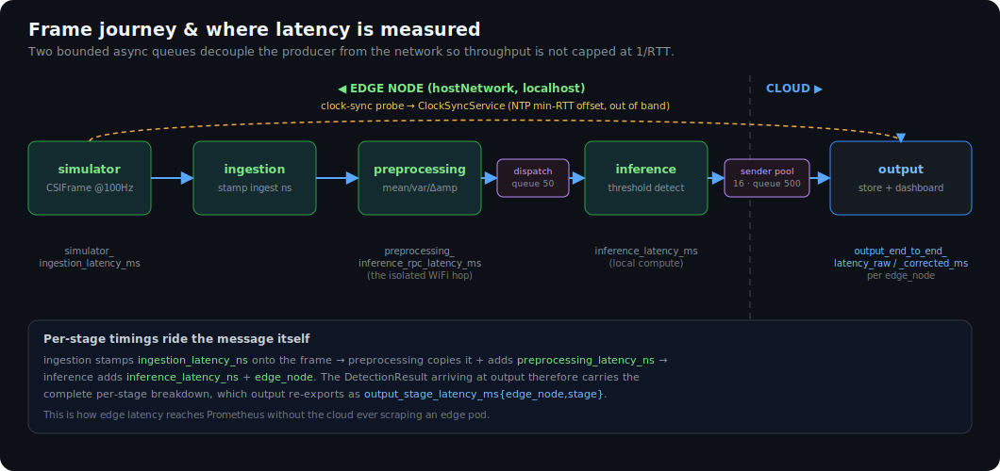

# Architecture

ISAC-k8s is deliberately split along **one seam**: the sensing *hot-path* runs on the edge, and only
finished detections cross the network to the cloud. Everything else — the runtime (KubeEdge), the
networking, the observability — is arranged to protect that seam. This page is the overview; the
child pages drill into each piece.

## The cluster shape

| Node | KubeEdge role | Runs |
|---|---|---|
| **cloud** (kind cluster, single untainted node) | `cloudcore` (CloudHub + CloudStream + dynamicController) | `output` (collector + dashboard), `prometheus`, `grafana` |
| **edge node ×N** (`edgecore`, label `isac-edge=true`) | `edged` + `edgehub` + `metamanager` + `edgeStream` | `simulator`, `ingestion`, `preprocessing`, `inference` — one set per node, via DaemonSets |

Two namespaces: `isac-sensing` (the pipeline) and `isac-monitoring` (Prometheus + Grafana).

## The three load-bearing decisions

### 1. The whole hot-path is node-local

`simulator → ingestion → preprocessing → inference` all run on the **same edge node** and talk over
`localhost`. A DaemonSet places exactly one pod of each per node, and `hostNetwork: true` means
`localhost:50052` is *always this node's* preprocessing. The only hop that leaves the node is the
low-rate `DetectionResult` fan-in to the central `output`. This is what makes the system scale: the
cloud is no longer a per-frame bottleneck. → [Edge node](architecture/edge-node), [Pipeline](architecture/pipeline)

### 2. Routing is chosen per hop, because the edge has no kube-proxy or DNS

- **Node-local hops** use `localhost:<port>` — no Service, no kube-proxy, sub-millisecond.
- **The one cross-node hop** (`inference → output`, and the `simulator → output` clock probe)
  resolves `output` via **EdgeMesh**, with a **NodePort `:30054`** as a reliable fallback.

→ [Networking](architecture/networking)

### 3. Observability pushes through the fan-in

The cloud cannot scrape edge pod IPs under KubeEdge. So the latency data *rides the data path*:
each `DetectionResult` carries its own per-stage timings, and `output` re-exports them to Prometheus
labeled per edge node. Prometheus scrapes **only** the cloud-side `output` pod.
→ [Observability](architecture/observability), [Latency & clock sync](architecture/latency)

## How a frame flows

1. `simulator` generates a `CSIFrame` (synthetic CSI, ~100 Hz) and calls `ingestion` over localhost.
2. `ingestion` stamps its own latency and forwards to `preprocessing`.
3. `preprocessing` computes features, then **hands off asynchronously** (bounded queue) to
   `inference` — so a slow network hop can't stall the producer.
4. `inference` runs a threshold detector, stamps the origin `edge_node`, and **hands off
   asynchronously** (bounded queue + sender-thread pool) to the cross-node `output`.
5. `output` computes end-to-end latency, applies clock-skew correction, stores the result, updates
   the dashboard, and exposes per-node Prometheus metrics.

The two async hand-offs (steps 3 and 5) are the fix for the original fully-synchronous chain that
capped throughput at `1/round-trip-latency`. See [Latency & clock sync](architecture/latency) for
the measurement design and the review that drove these changes.

## Where to go next

- [Pipeline & services](architecture/pipeline) — the code, service by service.
- [gRPC & the `.proto` contract](architecture/grpc-proto) — the wire format.
- [Edge node](architecture/edge-node) — KubeEdge edgecore internals + scheduling.
- [Networking](architecture/networking) — the per-hop routing rules.
- [Observability & metrics](architecture/observability) — the full metrics catalogue.
- [Latency & clock sync](architecture/latency) — correctness of the headline number.
