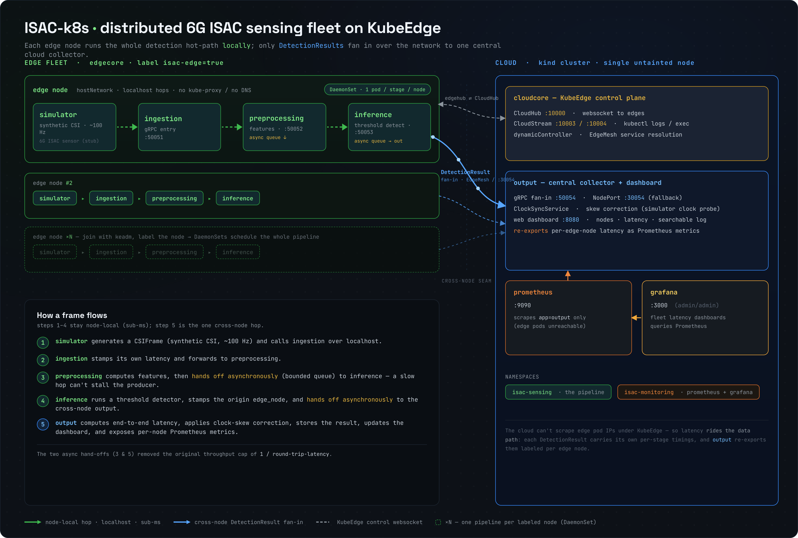

# ISAC-k8s
{: .fs-9 }

A distributed **6G ISAC** (Integrated Sensing And Communication) sensing system that runs a
5-stage gRPC detection pipeline across a fleet of edge nodes on **KubeEdge**, fans the results
into one central cloud collector, and shows every edge node, its data, and its latency on a live
dashboard.
{: .fs-6 .fw-300 }

[Get started](deployment){: .btn .btn-primary .fs-5 .mb-4 .mb-md-0 .mr-2 }
[View on GitHub](https://github.com/gambhirsharma/ISAC-k8s){: .btn .fs-5 .mb-4 .mb-md-0 }

---

## What this project is

ISAC ("Integrated Sensing and Communication") is a 6G idea: the same radio that carries data also
*senses* the environment — the channel state (CSI) from ordinary radio traffic reveals objects and
motion. This project builds the **distributed compute + orchestration substrate** such a system
needs: take a stream of sensor data, process and detect on it near the sensor, and aggregate
results centrally — at fleet scale, with per-node latency observability.

Because real ISAC hardware wasn't available, the architecture was built **top-down from the control
plane**. A `simulator` generates synthetic CSI as a stand-in for a future 6G ISAC sensor feed — and
it is the *only* component that gets swapped for real hardware later. Everything downstream is
source-agnostic.

## The shape in one paragraph

Five gRPC microservices — `simulator → ingestion → preprocessing → inference → output` — run on
**KubeEdge**: a **kind** cloud control plane (running `cloudcore`) plus a fleet of **edgecore** edge
nodes. Each edge node runs the entire detection hot-path (`simulator → ingestion → preprocessing →
inference`) **locally** over `localhost`; only the resulting `DetectionResult` fans in over the
network to a single central `output` collector. `output` tracks how many edge nodes are connected,
records their latency, re-exports it to Prometheus/Grafana, and serves a searchable web dashboard.
Add an edge node → join it with `keadm` → label it → its pipeline auto-schedules and starts
reporting. No per-node manifests.

## Two design ideas worth knowing up front

| Idea | Why |
|---|---|
| **The whole hot-path lives on the edge node** | Previously every frame crossed the network to a central inference. Now only the low-rate `DetectionResult` leaves the node — the real latency + scalability win. See [Edge node](architecture/edge-node). |
| **Observability rides the fan-in** | Under KubeEdge the cloud *cannot* scrape edge pod IPs. So every `DetectionResult` carries its own per-stage timings, and `output` re-exports them as per-node Prometheus metrics. See [Observability](architecture/observability). |

## Documentation map

Start here, then drill into whichever topic you need — each is a standalone deep-dive.

- **[Architecture](architecture)** — the big picture, then click into the topics:
  - [Pipeline & services](architecture/pipeline) — the five microservices, stage by stage.
  - [gRPC & the `.proto` contract](architecture/grpc-proto) — messages, services, why gRPC.
  - [Edge node](architecture/edge-node) — how a KubeEdge edge node runs the hot-path.
  - [Networking](architecture/networking) — hostNetwork/localhost vs EdgeMesh/NodePort fan-in.
  - [Observability & metrics](architecture/observability) — push-through-fan-in, Prometheus, Grafana, dashboard.
  - [Latency & clock sync](architecture/latency) — the metric design and its correctness gate.
- **[Deployment & operations](deployment)** — stand up the cloud, join an edge, run it, view it.

## Why KubeEdge

`edgecore` replaces a full node agent at **~70 MB idle** (no kube-proxy/etcd) and gives **edge
autonomy** — the hot-path keeps running if the cloud link drops. `cloudcore` runs on an upstream
Kubernetes; here that's a **kind** cluster (real k8s inside Docker: isolated, no host changes).
Edge devices join over a websocket, not as ordinary k8s nodes, so the cloud's CNI is irrelevant to
them — which is exactly why kind works as the cloud even with a physical device as the edge.
